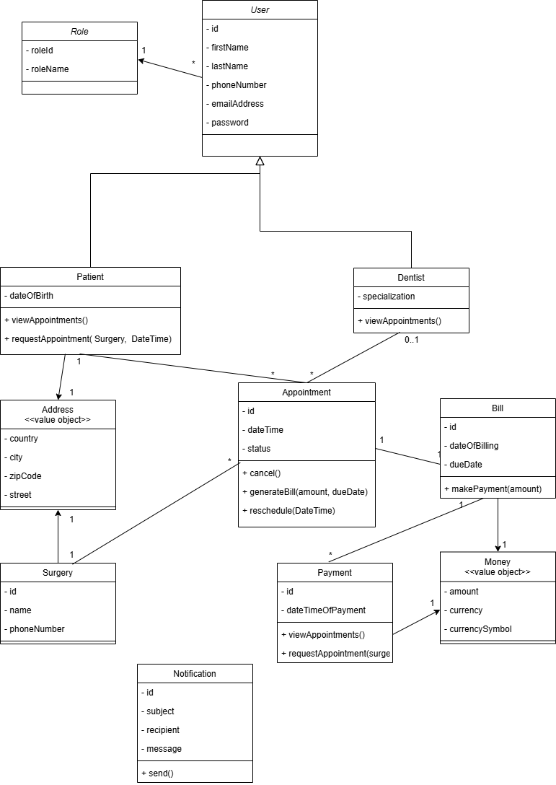
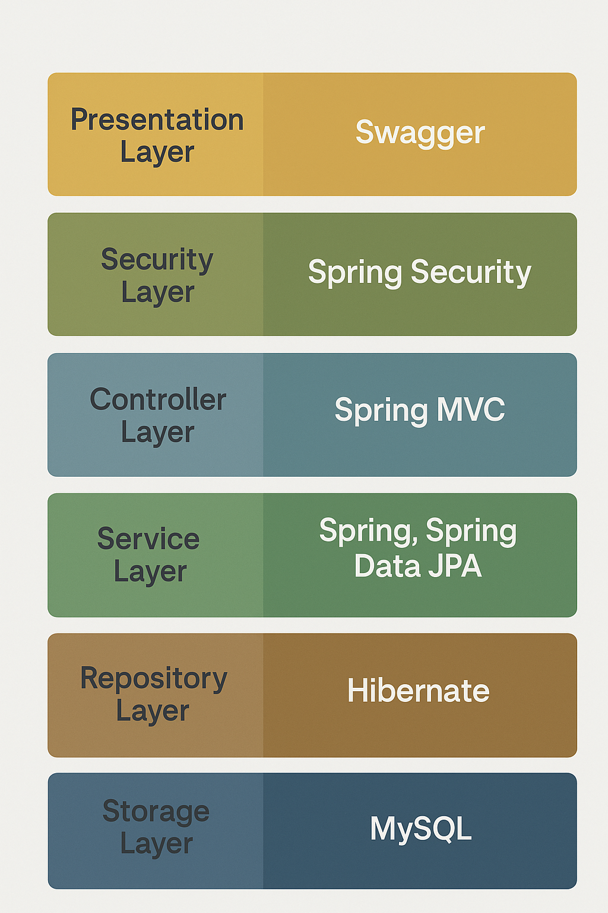

# 🦷 Dental Surgeries Appointment Management System

This is a Spring Boot-based REST API designed to manage dental surgeries and appointments. It features secure JWT authentication, role-based access control, and dynamic data filtering.

---

## 🚀 Functional Requirements

- ✅ Office Managers can register new Dentists.
- ✅ Office Managers can enroll new Patients into the system.
- ✅ Patients can submit appointment requests through the ADS website.
- ✅ Office Managers can schedule appointments between Patients and Dentists, considering availability and scheduling rules.
- ✅ Dentists can log in and view their scheduled appointments along with Patient details.
- ✅ Patients can log in and see their upcoming appointments, including Dentist information and surgery location.
- ✅ Patients can request to cancel or reschedule appointments.
- ✅ Each Dentist is limited to a maximum of five (5) appointments per calendar week.
- ✅ Patients with outstanding unpaid bills are restricted from submitting new appointment requests.

---

## 📊 Class Diagram




## 🛠 Technology Stack

- **Java 21**
- **Spring Boot 3**
- **Spring Security with JWT**
- **Hibernate (JPA)**
- **MySQL**
- **Swagger / OpenAPI**
- **Maven**



---

## 📖 API Documentation

After starting the application, the Swagger UI will be available at:

[http://localhost:8080/swagger-ui.html](http://localhost:8080/swagger-ui.html)

---

## 🧪 How to Run the Application Locally

1. **Clone the repository**
   ```bash
   git clone https://github.com/mkoner/cs489-ADS_Dental_Surgeries.git
   cd dental-surgeries-api
   ```

2. **Prepare the MySQL database**  
   Log in to your MySQL instance and run:
   ```sql
   CREATE DATABASE ads_db;
   ```

3. **Update application.properties**  
   Edit `src/main/resources/application.properties`:
   ```properties
   spring.datasource.url=jdbc:mysql://localhost:3306/ads_db
   spring.datasource.username=your_username
   spring.datasource.password=your_password
   ```

4. **Build and start the application**
   ```bash
   ./mvnw clean package
   java -jar target/ads.jar
   ```

---
## 🐳 Running the Application with Docker

Make sure Docker is installed and running on your machine. Then, from the root directory of the project, execute the following command:

```bash
docker-compose up
```
To run in detached mode (in the background), use:
```bash
docker-compose up -d
```
---

## 🧪 Running Tests

```bash
./mvnw test
```

---

## 📂 Project Structure

```
├── controller/       # REST API endpoints
├── service/          # Service layer: Orchestrates business logic
├── repository/       # Data access layer
├── dto/              # Data Transfer Objects (Request/Response models)
├── model/            # JPA entity mappings
├── config/           # Security, Swagger, and other configurations
├── security/         # JWT utilities and authentication mechanisms
└── exception/        # Global exception handling
```

---

## 📬 Contact

For questions or feedback, please reach out to **mamadou544kone@gmail.com**.
